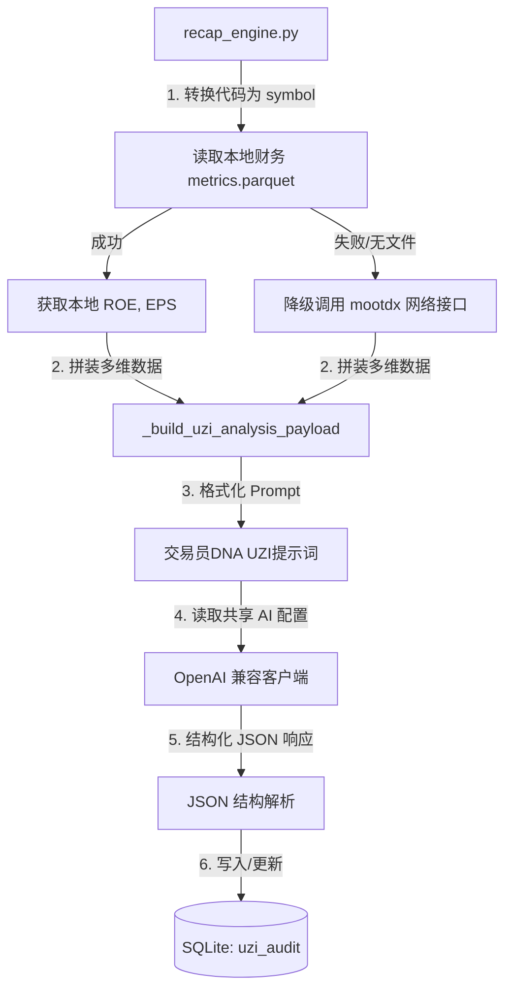

# 寻龙诀 · 统一数据源与内置 UZI 大模型审计设计方案

* **日期**：2026-06-26
* **版本**：1.0
* **作者**：Antigravity (Oh My Pi Coding Agent)
* **状态**：设计中（已评审）
* **结论**：在复盘引擎内部实现本地优先财务数据读取，并完全内置 UZI 大模型审计，脱离外部子进程与仓库克隆。

---

## 1. 背景与目标

当前寻龙诀复盘引擎在财务数据读取与大模型审计方面存在两个痛点：
1. **财务数据读取效率低且易受限**：直接调用 `mootdx` 外部网络接口获取 ROE、EPS 等数据，容易因网络波动或限流导致运行缓慢或异常。
2. **大模型审计（UZI-Skill）管道脆弱**：Online 模式需要克隆外部 `UZI-Skill` 项目，通过子进程执行并生成 HTML，再用正则解析 HTML。此管道在本地容易因路径问题失效，在 Docker 容器化环境中更是无法正常构建和运行。

本设计的目标是：
1. **数据层打通**：在 `recap_engine.py` 中优先读取 `tickflow-stock-panel` 同步好的本地 Parquet 财务文件，无本地数据时再降级通过 `mootdx` 网络拉取。
2. **大模型审计内聚**：将 UZI 大模型审计逻辑（Prompt 模板、结构化 API 请求）直接内置于 `recap_engine.py`，共享后台的统一 AI 网关配置，废弃外部子进程依赖。
3. **说人话/交易员 DNA 表达**：重写操作建议与审计 Prompt 的系统提示词，去除冗余的 AI 味，使用超短线专业术语。

---

## 2. 详细设计

### 2.1 本地财务数据优先与多列名兼容读取

重构财务数据收集逻辑：
1. **路径推导**：读取环境变量 `DATA_DIR`（容器内默认为 `/app/data`），若无，则 fallback 到开发环境路径 `./vendor/tickflow-stock-panel/data`。
2. **读取 Parquet**：使用 `pandas.read_parquet` 读取 `DATA_DIR/financials/metrics/part.parquet`。
3. **代码标准化**：将 6 位股票代码转换为标准化 symbol 格式（如 `"600519"` -> `"600519.SH"`，`"000001"` -> `"000001.SZ"`，`"835181"` -> `"835181.BJ"`）。
4. **多列名映射**：
   * ROE 取值顺序：`roe` -> `roe_waa` -> `净资产收益率`
   * EPS 取值顺序：`eps` -> `eps_basic` -> `每股收益`
5. **双轨降级**：本地读取异常或文件不存在时，发起网络 `mootdx` 备用请求。

### 2.2 内置 UZI 审计与共享 AI 配置

1. **共享配置读取**：
   * 引擎读取环境变量 `AI_PROVIDER`、`AI_BASE_URL`、`AI_API_KEY`、`AI_MODEL`。
   * 若无，则尝试加载 `.env` 或读取 `vendor/tickflow-stock-panel/backend/app/config.py` 中的默认配置（或在容器内通过环境变量读取）。
2. **内置 UZI 提示词生成**：
   * 汇总 `candidate`、`market`、`finance` 等维度的数据（利用已有的 `_build_uzi_analysis_payload` 产出结构化 payload）。
   * 构造包含三大评委席角色（Buffett 价值、赵老哥游资、Burry 排雷）的 Prompt。
3. **结构化 JSON 响应**：
   * 使用 OpenAI 兼容的 JSON Mode（`response_format={"type": "json_object"}`）调用大模型，要求返回如下 JSON 结构：
     ```json
     {
       "average_score": 85.0,
       "val_vote": "多头",
       "mom_vote": "观望",
       "risk_level": "安全",
       "summary": "【巴菲特价值席位】点评...\n【赵老哥游资席位】点评...\n【大空头排雷席位】点评...",
       "analysis": {
         "core_conclusion": "核心审计结论...",
         "highlights": [
           {"label": "估值亮点", "value": "..."},
           {"label": "主力资金", "value": "..."}
         ],
         "gaps_preview": ["..."],
         "coverage": {"filled": 6, "total": 6, "label": "6/6"}
       }
     }
     ```
   * 引擎直接解析此 JSON，更新 `uzi_audit` 历史数据库表中的对应记录。

### 2.3 “说人话”游资 DNA 表达规范

在 System Prompt 中加入强约束：
1. **禁止公关套话**：严禁出现“呈现强势格局”、“建议理性投资”、“我们看到”等无意义 AI 味废话。
2. **纯粹冷酷动作片**：直奔交易逻辑。用且仅用 A 股游资超短线黑话，如“竞价爆量分歧”、“开盘强行按死”、“主力隔夜抢跑”、“连板分歧”、“高位缩量加速”。
3. **极致干瘪字数限制**：`summary` 每个席位的点评限制在 80 字以内。

---

## 3. 数据流设计



---

## 4. 影响与回归

* **代码库净化**：彻底解除对 `../UZI-Skill` 项目的物理依赖，使得 Docker 可以无缝打包并跑通盘后全量审计。
* **测试覆盖**：在 `tests/test_recap_pipeline.py` 中增加对本地 Parquet 读取、多列名映射以及大模型 Mock 调用流程的测试用例。
